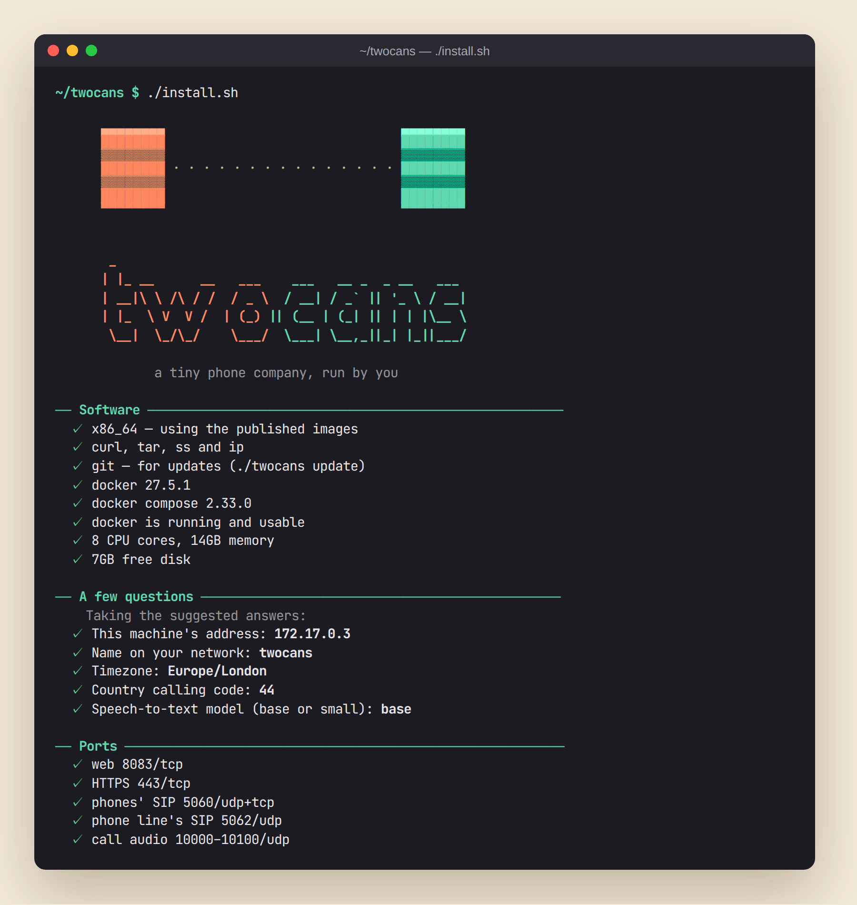
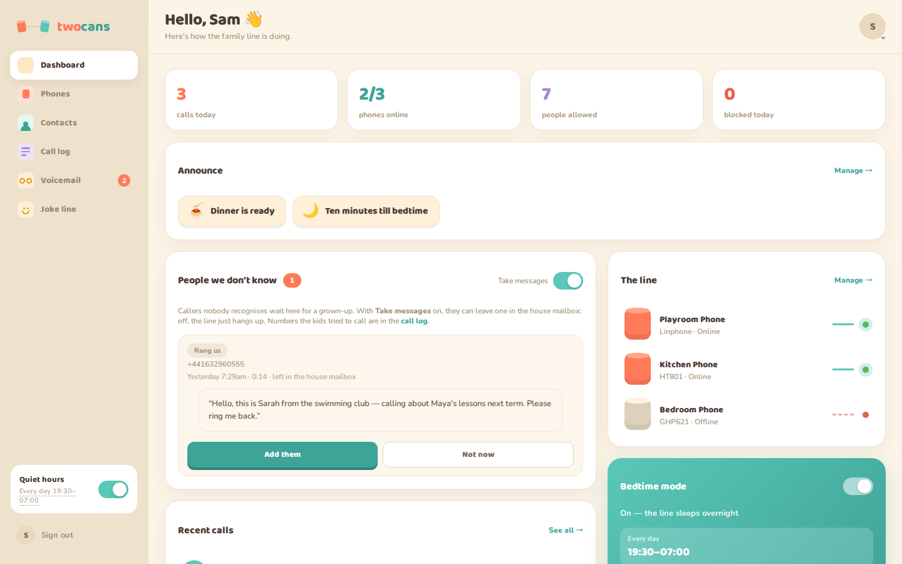
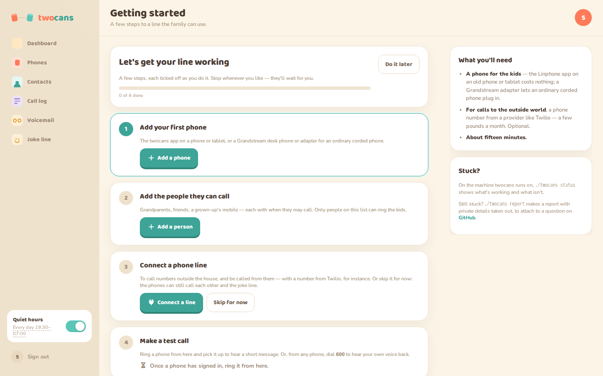
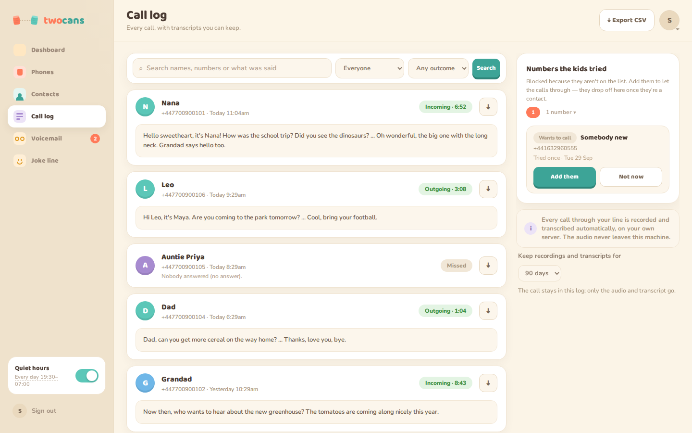
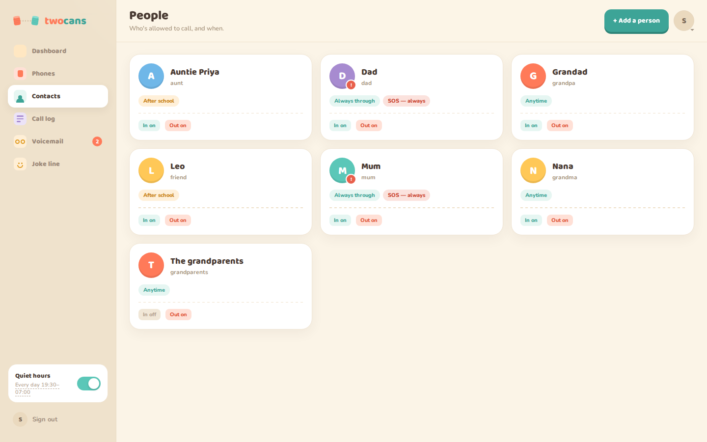
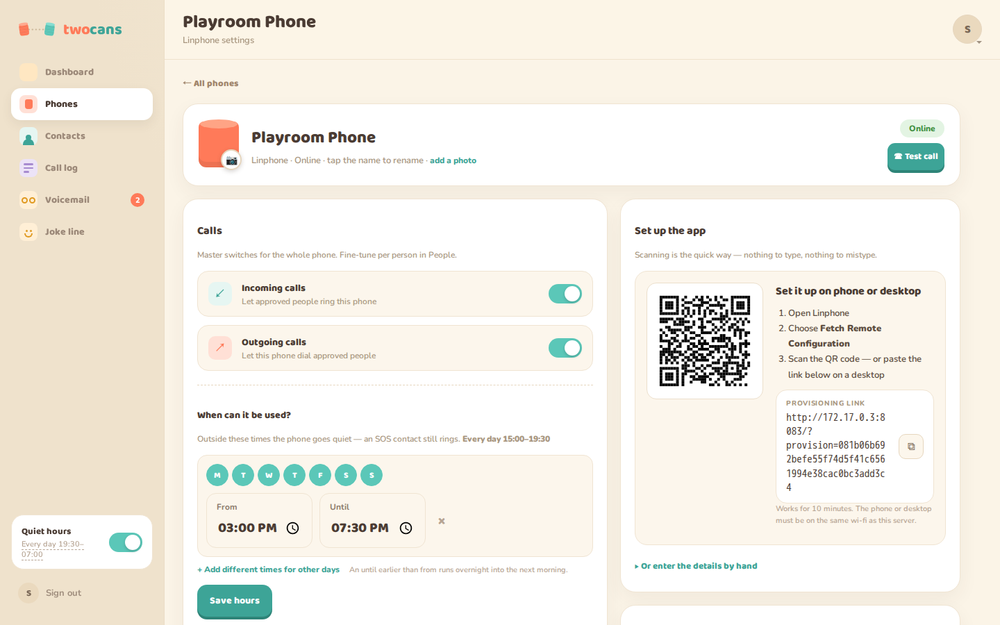
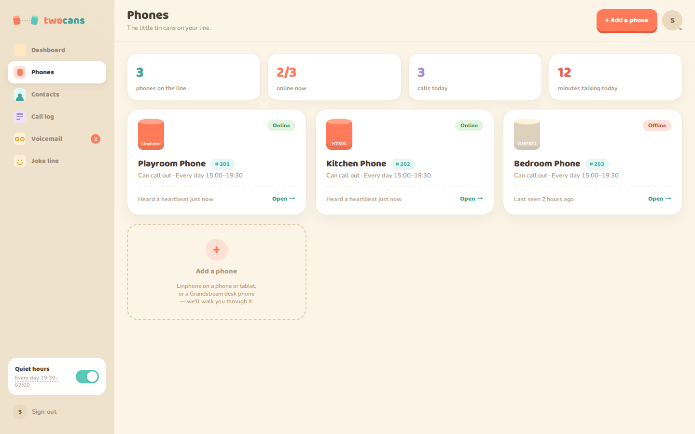
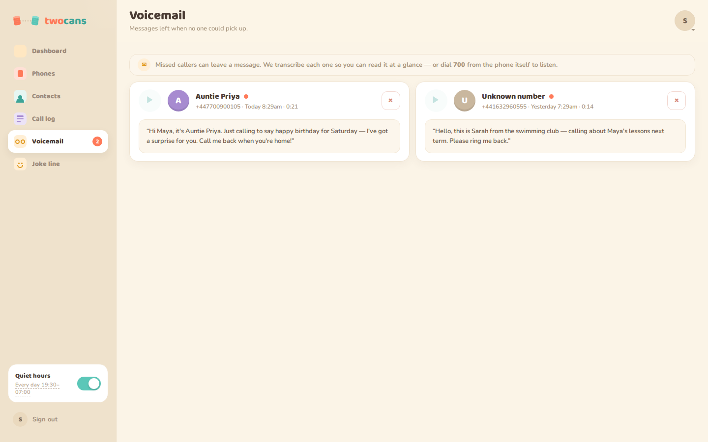
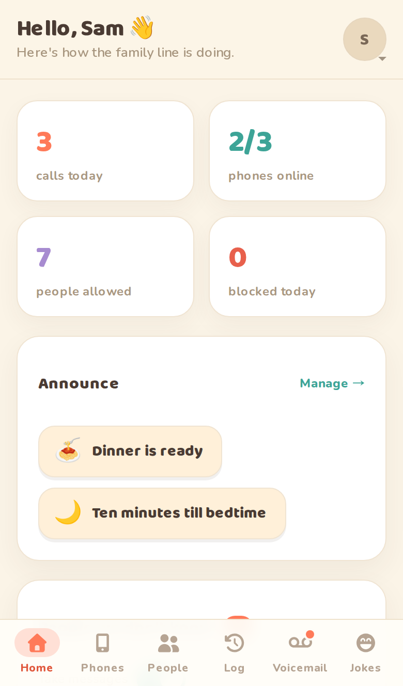
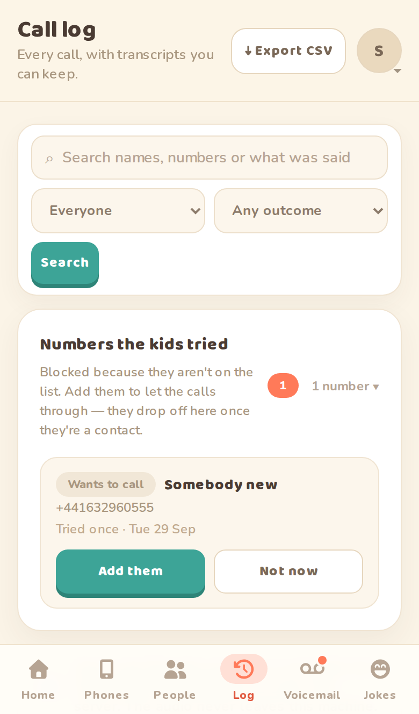

# twocans

**A tiny phone company, run by you.** A self-hosted phone line for kids: they call
from the twocans app on an old phone or tablet, a desk phone, or an ordinary corded
phone plugged into an adapter — and you decide **who** they can call, **when**, and
see **what happened**, with every call recorded and transcribed on your own machine.

## Install in one line

```bash
curl -fsSL https://raw.githubusercontent.com/tombruton87/TwoCans/main/get.sh | bash
```

On any Linux machine your phones can reach — a Raspberry Pi is ideal. It installs
what's missing (Docker included, asking first), asks a few questions, and starts
twocans. [Read the script first](get.sh) if you like; it's short.



## What it looks like



| | |
|---|---|
|  **Getting started** — a checklist after you sign up |  **Call log** — every call, with its transcript |
|  **People** — who can call, and when |  **Phones** — each with its own hours and limits |
|  **The phones on the line** |  **Voicemail**, transcribed |

On a phone, it's an app you can add to your home screen:

<p>
  
  &nbsp;
  
</p>

<sub>Screenshots from a demo install — the family, numbers and calls are made up.</sub>

> Full documentation lives in the [`docs/`](docs/) folder.

## Install

### The one-liner, in more detail

It asks where to put twocans (`~/twocans` unless you say), installs git if it's
missing, fetches twocans and runs its installer. Run it again later and it updates
instead. Or do the same by hand:

```bash
git clone https://github.com/tombruton87/TwoCans.git twocans && cd twocans
./install.sh
```

`install.sh` walks you through it:

- **checks the software** — Docker (offering to install it with Docker's own script,
  or to start it), Compose, and the few tools it uses — plus memory and disk. The
  published images are built for Intel/AMD and for ARM, so a Raspberry Pi downloads
  them like anything else;
- **asks a few questions** — this machine's address, a name for it on your network,
  timezone, country code, and which speech-to-text model — suggesting an answer for
  each (Enter takes it);
- **checks the ports** — web, HTTPS, the phones' SIP port, the phone line's SIP port
  and the call audio range. If something else holds the web or HTTPS port it asks
  whether to use another, and suggests a free one; the SIP ports and call audio
  can't move, so a clash there is reported for you to free;
- **checks the firewall** — reads ufw's or firewalld's rules (with sudo, asking first),
  checks each port against them, and offers to add only what's missing;
- **checks this machine** — that its address won't change (one handed out by your
  router can), that Docker starts on boot, and that the clock is kept in time,
  offering to fix the last two — and makes it reachable by name, as
  `http://twocans.local:8083`, through Avahi;
- writes `.env` with fresh passwords, pulls the images, starts everything, installs
  Asterisk's spoken prompts, and sets up the database.

Then open the address it prints and create your account. A short **Getting
started** checklist follows — add a phone, add people, connect a line (or skip it),
make a test call — which you can leave for later; it stays in the menu.

```bash
./install.sh --check        # check everything, change nothing
./install.sh --yes          # take every suggestion, ask nothing
./install.sh --reconfigure  # answer the questions again (passwords are kept)
./install.sh --uninstall    # stop and remove twocans; your data is kept unless you say so
./install.sh --reset-owner  # locked out? reset the Owner's password, email or passkeys
```

**To update:** `git pull && ./install.sh` — it keeps your settings and passwords, and
only restarts the phone service if something it depends on changed.

### Or by hand — copy the example compose

The repo ships a ready-to-run compose file with the example values **inlined**, so
there is no `.env` to write by hand:

```bash
git clone https://github.com/tombruton87/TwoCans.git && cd TwoCans
cp compose.example.yml compose.yml     # then edit the values below
docker compose up -d
```

Edit `compose.yml` before you start:

- **`SIP_DOMAIN`** and **`APP_URL`** — your LAN IP (phones register to it; not `localhost`)
- **`DB_PASSWORD`**, **`DB_ROOT_PASSWORD`**, **`ARI_PASSWORD`**, **`AMI_PASSWORD`** — replace the `change-me`s
- **`APP_KEY`** — a 64-hex-char key: `php -r "echo bin2hex(random_bytes(32)), PHP_EOL;"`
- **`TZ`** — your timezone

Asterisk reads its two control passwords from files of their own, kept out of git.
Write them with the same values as `ARI_PASSWORD` and `AMI_PASSWORD`:

```bash
mkdir -p docker/asterisk/etc/secrets
printf 'password = %s\n' 'your-ARI_PASSWORD' > docker/asterisk/etc/secrets/ari.conf
printf 'secret = %s\n' 'your-AMI_PASSWORD' > docker/asterisk/etc/secrets/manager.conf
```

This route doesn't fetch Asterisk's spoken prompts, which group calls need —
`./install.sh` does, and is safe to run afterwards.

Then open `http://<your-ip>:8083` and create the household Owner.

`docker compose up` pulls the images from Docker Hub (`hamletdigital/...`); the app
is baked into `twocans-web`, so nothing is built. The optional `cloudflared` and
`adminer` services are behind `--profile tunnel` / `--profile tools`.

### The full example compose

```yaml
# TwoCans example compose. Edit the values, then: docker compose up -d
# (copy with: cp compose.example.yml compose.yml)
# Asterisk reads ARI_PASSWORD and AMI_PASSWORD from files kept out of git —
# write them first (see the README), or use ./install.sh, which does it all.

services:
  asterisk:
    image: andrius/asterisk:22
    container_name: twocans-asterisk
    restart: unless-stopped
    ports:
      - "5060:5060/udp"
      - "5060:5060/tcp"
      # The SIP trunk, on its own port so it can advertise the public address.
      - "${TRUNK_SIP_PORT:-5062}:${TRUNK_SIP_PORT:-5062}/udp"
      - "10000-10100:10000-10100/udp"
    volumes:
      - ./docker/asterisk/etc:/etc/asterisk
      - ./docker/asterisk/cdr:/var/log/asterisk/cdr-csv
      - ./docker/asterisk/recordings:/var/spool/asterisk/monitor
      - ./docker/asterisk/voicemail:/var/spool/asterisk/voicemail
      - ./docker/asterisk/asks:/var/spool/asterisk/asks
      - ./storage:/var/lib/twocans:ro
      - asterisk-lib:/var/lib/asterisk
      # The spoken prompts install.sh fetches. The image declares this folder a
      # volume of its own; left unnamed, it is lost whenever the stack is taken
      # down, and group calls then admit nobody.
      - asterisk-sounds:/var/lib/asterisk/sounds
      - asterisk-spool:/var/spool/asterisk
      - asterisk-log:/var/log/asterisk
    environment:
      TZ: Europe/London
    networks: [twocans]
    healthcheck:
      test: ["CMD", "asterisk", "-rx", "core show version"]
      interval: 10s
      timeout: 5s
      retries: 3

  mariadb:
    image: mariadb:11.4
    container_name: twocans-mariadb
    restart: unless-stopped
    environment:
      MARIADB_ROOT_PASSWORD: change-me
      MARIADB_DATABASE: twocans
      MARIADB_USER: twocans
      MARIADB_PASSWORD: change-me
      TZ: Europe/London
    volumes:
      - mariadb-data:/var/lib/mysql
      - ./docker/mariadb/log:/var/log/mysql
    healthcheck:
      test: ["CMD", "healthcheck.sh", "--connect", "--innodb_initialized"]
      interval: 10s
      timeout: 5s
      retries: 5
    networks: [twocans]

  web:
    image: docker.io/hamletdigital/twocans-web:latest
    container_name: twocans-web
    restart: unless-stopped
    depends_on:
      mariadb: {condition: service_healthy}
    ports:
      - "8083:80"
      - "443:443"
    environment:
      DB_HOST: mariadb
      DB_PORT: 3306
      DB_NAME: twocans
      DB_USER: twocans
      DB_PASSWORD: change-me
      ARI_BASE_URL: http://asterisk:8088
      ARI_USERNAME: twocans
      ARI_PASSWORD: change-me
      AMI_HOST: asterisk
      AMI_PORT: 5038
      AMI_USERNAME: twocans
      AMI_PASSWORD: change-me
      ASTERISK_GENERATED_DIR: /etc/asterisk/generated
      APP_KEY: 0123456789abcdef0123456789abcdef0123456789abcdef0123456789abcdef
      SIP_DOMAIN: 192.168.1.10
      APP_URL: http://192.168.1.10:8083
      DEFAULT_COUNTRY_CODE: 44
      CDR_CSV_PATH: /var/log/asterisk/cdr-csv/Master.csv
      RECORDINGS_PATH: /var/spool/asterisk/monitor
      VOICEMAIL_PATH: /var/spool/asterisk/voicemail
      ASK_RECORDINGS_PATH: /var/spool/asterisk/asks
      PHOTO_PATH: /var/lib/twocans/photos
      JOKES_PATH: /var/lib/twocans/jokes
      REFUSALS_PATH: /var/lib/twocans/refusals
      BACKUPS_PATH: /var/lib/twocans/backups
      WHISPER_URL: http://whisper:9000
      WHISPER_LANGUAGE: en
      TZ: Europe/London
    volumes:
      - ./docker/asterisk/etc:/etc/asterisk
      - ./docker/asterisk/cdr:/var/log/asterisk/cdr-csv:ro
      - ./docker/asterisk/recordings:/var/spool/asterisk/monitor
      - ./docker/asterisk/voicemail:/var/spool/asterisk/voicemail
      - ./docker/asterisk/asks:/var/spool/asterisk/asks
      - ./docker/php/log:/var/log/php-fpm
      - ./docker/nginx/log:/var/log/nginx
      - ./storage:/var/lib/twocans
      - ./docker/nginx/certs:/certs
      - ./docker/nginx/acme:/acme
      - ./docker/web/nginx.conf:/etc/nginx/http.d/default.conf:ro
    networks: [twocans]
    healthcheck:
      test: ["CMD", "wget", "--quiet", "--tries=1", "--spider", "http://127.0.0.1/"]
      interval: 10s
      timeout: 5s
      retries: 3

  transcriber:
    image: docker.io/hamletdigital/twocans-web:latest
    container_name: twocans-transcriber
    restart: unless-stopped
    depends_on:
      mariadb: {condition: service_healthy}
    entrypoint: ["php"]
    command: ["/var/www/html/bin/transcribe.php", "--watch"]
    environment:
      DB_HOST: mariadb
      DB_PORT: 3306
      DB_NAME: twocans
      DB_USER: twocans
      DB_PASSWORD: change-me
      RECORDINGS_PATH: /var/spool/asterisk/monitor
      VOICEMAIL_PATH: /var/spool/asterisk/voicemail
      ASK_RECORDINGS_PATH: /var/spool/asterisk/asks
      JOKES_PATH: /var/lib/twocans/jokes
      REFUSALS_PATH: /var/lib/twocans/refusals
      WHISPER_URL: http://whisper:9000
      WHISPER_LANGUAGE: en
      WHISPER_MODEL: base
      TZ: Europe/London
    volumes:
      - ./docker/asterisk/recordings:/var/spool/asterisk/monitor:ro
      - ./docker/asterisk/voicemail:/var/spool/asterisk/voicemail:ro
      - ./docker/asterisk/asks:/var/spool/asterisk/asks:ro
      - ./storage:/var/lib/twocans:ro
    networks: [twocans]

  whisper:
    image: docker.io/hamletdigital/twocans-whisper:latest
    container_name: twocans-whisper
    restart: unless-stopped
    environment:
      WHISPER_MODEL: base
      WHISPER_LANGUAGE: en
      WHISPER_COMPUTE_TYPE: int8
      WHISPER_THREADS: 4
      TZ: Europe/London
    volumes:
      - whisper-models:/data/whisper
    cpus: 4.0
    mem_limit: 2g
    networks: [twocans]

  cloudflared:
    image: cloudflare/cloudflared:latest
    container_name: twocans-cloudflared
    restart: unless-stopped
    profiles: ["tunnel"]
    command: ["tunnel", "--no-autoupdate", "run"]
    environment:
      TUNNEL_TOKEN: 
      TZ: Europe/London
    networks: [twocans]

  adminer:
    image: adminer:5
    container_name: twocans-adminer
    restart: unless-stopped
    profiles: [tools]
    depends_on: [mariadb]
    ports:
      - "8089:8080"
    environment:
      ADMINER_DEFAULT_SERVER: mariadb
    networks: [twocans]

volumes:
  mariadb-data:
  whisper-models:
  asterisk-lib:
  asterisk-sounds:
  asterisk-spool:
  asterisk-log:

networks:
  twocans:
    driver: bridge
```

## Looking after it

Once it's installed, `./twocans` does the rest — run it on its own for the list:

| | |
|---|---|
| `./twocans status` | is everything working? Containers, phones, the phone line and its credit, today's calls, backups and disk space |
| `./twocans logs [part]` | follow what's happening — `phone`, `web`, `transcription`, `database` or `all` |
| `./twocans backup` · `backups` · `restore` | make a backup, list them, or put one back (it asks, and keeps a safety copy) |
| `./twocans export` | your data in one zip: the call log, voicemails and contacts as spreadsheets, and the recordings |
| `./twocans version` · `update` | what's installed and what's newest, and updating to it |
| `./twocans report` | a support report for a GitHub issue, with passwords, names, numbers and addresses taken out |
| `./twocans reset-owner` | locked out? reset the Owner's password, email or passkeys |
| `./twocans check` · `uninstall` | the installer's checks, or removing twocans (your data is kept unless you say) |

Backups, exports and reports land in `storage/backups`, `storage/exports` and
`storage/reports`, readable only by you — they hold your family's calls.

## What runs

| Service | Image | Purpose |
| --- | --- | --- |
| `web` | `hamletdigital/twocans-web` | the app — nginx + PHP-FPM in one; the app is baked in |
| `transcriber` | `hamletdigital/twocans-web` | worker that transcribes recordings |
| `whisper` | `hamletdigital/twocans-whisper` | speech-to-text, on this box |
| `asterisk` | `andrius/asterisk:22` | the PBX (SIP + RTP) |
| `mariadb` | `mariadb:11.4` | the database |

## License

**Business Source License 1.1** — free for household / non-commercial
self-hosting (see [`LICENSE`](LICENSE)); it converts to Apache-2.0 on its Change
Date. The "TwoCans" name and mark are trademarks of Hamlet Digital.

## Contributing

See [`CONTRIBUTING.md`](CONTRIBUTING.md), [`SECURITY.md`](SECURITY.md) and
[`CODE_OF_CONDUCT.md`](CODE_OF_CONDUCT.md).

Built and published by Hamlet Digital. Issues, PRs and questions welcome.
